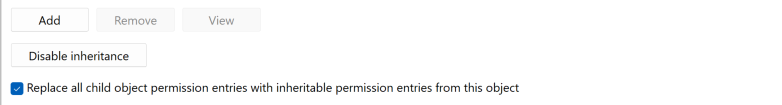

# FAQs

## Table of Contents

- [Uninstall Error (Access to path denied)](#resolving-uninstall-error-access-to-path-denied)
- [`Import-Module` issues](#import-module-issues)
- [Uninstallation issues](#uninstallation-issues)
- [`Initialize-NatNetwork` issues](#initialize-natnetwork-issues)

## `Import-Module` issues

- [Unblock-File](https://learn.microsoft.com/en-us/powershell/module/microsoft.powershell.utility/unblock-file?view=powershell-7.4)
- [Error when running Import-Module](https://vnote42.net/2019/07/30/error-when-running-import-module/)
- [Unblock a script to run it without changing the execution policy](https://learn.microsoft.com/en-us/powershell/module/microsoft.powershell.security/set-executionpolicy?view=powershell-7.4#example-7-unblock-a-script-to-run-it-without-changing-the-execution-policy)

## Uninstallation issues

<!-- 
#####################################################################
####################### Access to path denied #######################
#####################################################################
-->
### Access to path denied

If you encounter an Access to path denied error during the uninstall process, even with Administrator privileges, it typically stems from issues with folder ownership. To resolve this, you'll need to reassign ownership to an account with administrative privileges. You can accomplish this using the `takeown` command.

Example:

```PowerShell
takeown /f "C:\ProgramData\containerd" /r /d Y
```

After successfully changing the ownership, you can proceed to remove the folder manually.

If the issue persists, navigate to the folder's properties and choose the option to `Replace all child object permission entries with inheritable permission entries from this object`. This action will apply the inheritable permissions set on this folder to all sub-folders and files within it.



1. Navigate to the folder.
2. Right-click on the folder and choose **Properties**.
3. Go to the **Security** tab.
4. Click on **Advanced**.
5. In the Advanced Security Settings, select the option `Replace all child object permission entries with inheritable permission entries from this object`.
6. Apply the changes and confirm.

## `Initialize-NatNetwork` issues

<!-- 
#####################################################################
#################### Could not import HNS module ####################
#####################################################################
-->
### 1. Could not import HNS module

Ensure 'Hyper-V Host Compute Service' Windows features are enabled.

```PowerShell
Get-WindowsOptionalFeature -Online | `
    Where-Object { $_.FeatureName -match "Microsoft-Hyper-V(-All)?$" } | `
    Select-Object FeatureName, Possible, State, RestartNeeded
```

To enable a feature:

```PowerShell
Enable-WindowsOptionalFeature -Online -FeatureName '<Feature-Name-Here>' -All -NoRestart

# Restart device to apply changes
# Restart-Computer
```

[Restart the operating system](https://learn.microsoft.com/en-us/powershell/module/microsoft.powershell.management/restart-computer?view=powershell-7.4) to apply changes.

<!-- 
#####################################################################
############### New-HNSNetwork command does not exist ###############
#####################################################################
-->
### 2. New-HNSNetwork command does not exist

The built-in `HostNetworkingService` PowerShell module does not include the `New-HNSNetwork` command. This command is available through the HNS module.

You can download it directly from the [microsoft/sdn](https://github.com/microsoft/SDN) repository.

> [!TIP]  
> The `hns.psm1` file should be saved in a directory that is included in the `$env:PSModulePath` environment variable.  
> In the example below, the module is saved in the "Current User, Current Host" profile directory. Read more about [PowerShell profiles](https://learn.microsoft.com/en-us/powershell/module/microsoft.powershell.core/about/about_profiles?view=powershell-7.4).

```powershell
$dirPath = (New-Item -Path "$(Split-Path $PROFILE.CurrentUserCurrentHost)/Modules/HNS" -ItemType Directory -Force).FullName
$Uri = 'https://raw.githubusercontent.com/microsoft/SDN/dd4e8708ed184b49d3fddd611b6027f1755c6edb/Kubernetes/windows/hns.v2.psm1'
Invoke-WebRequest -Uri $Uri -OutFile "$dirPath/hns.psm1"
```

After installing the module, import it into your session:

> [!TIP]  
> Ensure the [Execution Policy](https://learn.microsoft.com/en-us/powershell/module/microsoft.powershell.core/about/about_execution_policies?view=powershell-7.4#powershell-execution-policies) is set correctly to import the module.

```powershell
# Check if the module is installed
Get-Module -Name HNS -ListAvailable -Refresh

# Import the module
Import-Module HNS
```

> [!CAUTION]  
> **We do not recommend** using the [_third-party_ HNS module](https://www.powershellgallery.com/packages/HNS/0.2.4) available in the PowerShell Gallery. This module is **NOT** maintained and signed by Microsoft and may not be up-to-date with the latest changes in the HNS module.
> _Microsoft does **NOT** take any responsibility for issues that may arise from installing and/or execution of commands in any third-party modules/scripts. Install the _third-party_ HNS module at your own risk!_
